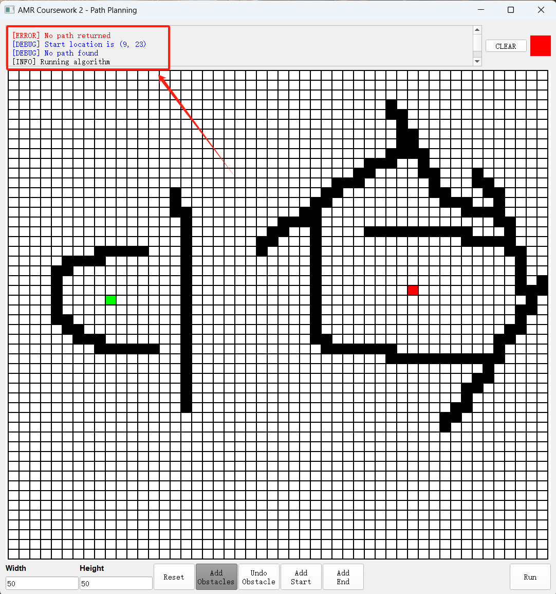

# Astar Algorithm path planner
## Introduction
The algorithm is mainly implemented in [pathplanner.py](https://github.com/Jcheems/jcheems.github.io/blob/master/assets/pathPlanner.py) and called by [gui.py](https://github.com/Jcheems/jcheems.github.io/blob/master/assets/gui.py). The programme uses four directions (up, down, left, right) for path calculation. Obstacles are indicated by black squares. When a path is found, a blue path is shown in the gui connecting a green start point to a red end point. You can visit the source code by clicking their name.
<div align="center">
     
    <div>
        <p>Example</p>
    </div>
</div>

## No path found
When no path is found, no path is planned and an error message is displayed in the window.
<div align="center">
     
    <div>
        <p>No path found</p>
    </div>
</div>

## Code Explanation
This Python code defines a function 'do_a_star' which implements the A* search algorithm for pathfinding on a grid. The function takes a grid, start and end points, and a function for displaying messages. Here's a step-by-step breakdown of what this code does:

### Initialization:
Retrieve the dimensions of the grid (COL and ROW).
Initialize open_list to store nodes that need to be evaluated and closed_list to store nodes that have already been evaluated.
Define came_from dictionary to track the path taken to reach each node.
Set up g_score dictionary to store the cost from the start node to every other node, initializing all values to infinity, except the start node which is set to zero.
Establish f_score dictionary to store the estimated total cost from the start node to the end through each node, initializing all values to infinity. The heuristic used is the Euclidean distance between the current node and the end node.

```Python
    # Get grid dimensions
    COL = len(grid)
    ROW = len(grid[0])

    # Initialize open list, closed list and directing dictionary 
    open_list = []  # Keep track of nodes to be evaluated
    closed_list = set()  # Keep track of nodes already evaluated
    came_from = {}  # Store the path taken to reach each node

    # Initialize g score dictionary with infinite distances
    g_score = {node: float('inf') for row in grid for node in row}  # Cost from start to each node
    g_score[start] = 0  # Cost from start to start is 0

    # Initialize f score dictionary with infinite distances
    f_score = {node: float('inf') for row in grid for node in row}  # Estimated total cost from start to end through each node
    f_score[start] = ((start[0] - end[0]) ** 2 + (start[1] - end[1]) ** 2)**0.5  # Heuristic for the start node
    
    open_list.append((f_score[start], start))  # Add the start node to the open list
```

### Processing Loop:
Continuously loop until there are no more nodes to evaluate in the open_list.
Select the node in open_list with the lowest f score, make it the current node, and remove it from open_list.
Check if the current node is the end node. If it is, backtrack using the came_from dictionary to construct the path from start to end, display messages, and return the path.
Add the current node to the closed_list as it has been evaluated.

```python
        while open_list:
        # Select the node in open_list with the lowest f score value
        current = min(open_list, key=lambda x: x[0])[1]
        open_list = [x for x in open_list if x[1] != current]  # Remove the current node from open list
        
        # Check if the current node is the end node
        if current == end:
            path = []  # Store the path from start to end
            while current in came_from:
                path.append(current)
                current = came_from[current]  # Traverse back from end to start
            path.append(start)  # Add the start node to the path
            path.reverse()  # Reverse the path to get it in correct order

            # Display debug messages
            display_message("Path points successfully created")
            display_message("Start location is " + str(start))

            return path  # Return the path
        
        closed_list.add(current)  # Mark the current node as evaluated
```
### Exploring Neighbors:
For each neighboring node in four possible directions (up, down, left, right), calculate its position.
Ensure that the neighbor is within the grid bounds and is traversable (the grid value must be 1, which typically means passable terrain).
If the neighbor is already in the closed_list, skip it.
Calculate a tentative g score as the g score of the current node plus the cost to move to the neighbor (assumed to be 1 for adjacent nodes).
If the neighbor is not in open_list, update came_from, g_score, and f_score, and add the neighbor to open_list.
If already in open_list but found a better path (lower g score), update came_from, g_score, f_score, and adjust its position in the open_list.

```python
            # Check nodes in four directions(up, down, left, right)
        for direction in [(0, 1), (1, 0), (0, -1), (-1, 0)]:
            neighbor = (current[0] + direction[0], current[1] + direction[1])
            
            # Ensure neighbor is within grid bounds and is traversable (grid value of 1)
            if (0 <= neighbor[0] < COL) and (0 <= neighbor[1] < ROW) and grid[neighbor[0]][neighbor[1]] == 1:
                if neighbor in closed_list:  # Skip if neighbor is already evaluated
                    continue
                
                tentative_g_score = g_score[current] + 1  # Tentative g score
                
                # Discover a new node or find a better path to an already discovered node
                if neighbor not in [x[1] for x in open_list]:
                    came_from[neighbor] = current  # Update director
                    g_score[neighbor] = tentative_g_score  # Update g score
                    f_score[neighbor] = g_score[neighbor] + ((neighbor[0] - end[0]) ** 2 + (neighbor[1] - end[1]) ** 2)**0.5  # Update f score
                    open_list.append((f_score[neighbor], neighbor))  # Add neighbor to open list
                elif tentative_g_score < g_score[neighbor]:  # Check if this path to neighbor is better than previously found
                    came_from[neighbor] = current  # Update director
                    g_score[neighbor] = tentative_g_score  # Update g score
                    f_score[neighbor] = g_score[neighbor] + abs(neighbor[0] - end[0]) + abs(neighbor[1] - end[1])  # Update f score

                    # Update the neighbor node in the open list with the new f score
                    open_list = [(f, pos) for f, pos in open_list if pos != neighbor]
                    open_list.append((f_score[neighbor], neighbor))
```

### Completion:
If the open_list is empty and no path has been found, display a message indicating no path was found, display the start location, and return an empty list.

```python
    # If the loop finishes without returning a path, no path was found
    display_message("No path found")
    display_message("Start location is " + str(start))
    return []  # Return an empty path if no path is found
```
