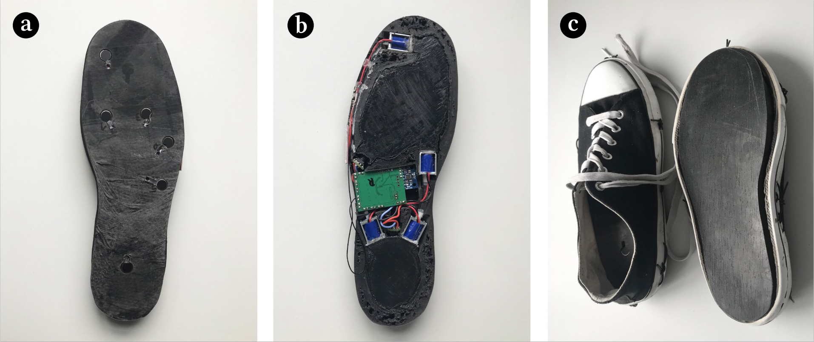

# Bachelor Thesis Design
## Exploring Reaction Time in an actual whole-body Jump’n Run Game
we develop a VR game in which players will respond to terrain changes simulated by smart shoes. We tested participants under different sound conditions
and observed their reaction times to terrain changes. We also performed simple
response tests on participants’ eye-hand reaction times to validate the results
of previous studies. Finally we find that most participants have a much slower
tactile response time to the foot than the eye-hand response. Moreover, the different sound conditions bring about a greater effect on the tactile response of
the foot than the eye-hand response.

## Experiment Tools
VR-HMD will be used for the demonstration of VR games. The game
is created and packaged into the head display through the unity engine, thanks
to the advantages of the meta quest pro all-in-one.

     
    

        
Meta quest pro

    

iPhone12 pro is really useful for its camera, as it is needed to record
the images of the subject during the experiment and to assist in determining the
reaction time data.

     
    

        
iPhone12

    

The air pods pro is used to create different sound environments for
the purpose of controlling variables.

     
    

        
Air pods pro

    

The smart insoles are useful in two ways. The first is the ability to
simulate changes in terrain, such as asphalt, grassy and sand. The second is
to capture the subject’s responses and record them via sensor transmission to a
computer terminal.

     
    

        
smart insoles

    

## Experiment Design
The experiment was divided into a simple reaction test and a VR scene reaction test.

### Simple Reaction Test
The experiment is conducted on the Human Benchmark website<a href="https://humanbenchmark.com" target="_blank">(https://humanbenchmark.com).</a> The experiment will be conducted five times
and the final results will be averaged. Participants will be tested under three different sound conditions while wearing headphones, and the experimenter will
record the results. The response speed of the participants is measured under
noise reduction, soothing background sound and high background sound as follows.
## Paper
More details please take a look at：<a href="./paper.pdf" target="_blank">Thesis Paper.</a>
