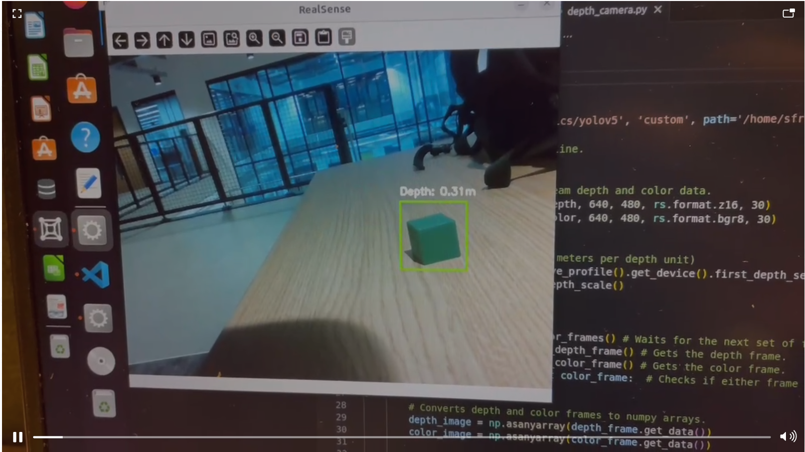

# Leo Rover project design
## Introduction
Leo Rover was one of the projects I conducted during my time at the University of Manchester, which I completed with three other members of the group. I was in charge of the part of the group where the manipulator gripped the objects. 

## Manipulator
My goal is to make the manipulator grasp the target within the working range and place it at a predetermined position. The model of the manipulator we are using is Interbotix X-Series px150 and it is controlled using Python. Since the Moveit package doesn't have an interface for ros2 at the moment, I can only control it based on some official Python demos.

```python
  def main():
    bot = InterbotixManipulatorXS(
        robot_model='px150',
        group_name='arm',
        gripper_name='gripper'
    )

    if (bot.arm.group_info.num_joints < 5):
        bot.core.get_logger().fatal('This demo requires the robot to have at least 5 joints!')
        bot.shutdown()
        sys.exit()

    bot.arm.go_to_sleep_pose()
    bot.arm.set_ee_pose_components(x=0.1, z=0.1, pitch=1.5)
    bot.arm.set_ee_cartesian_trajectory(z=0.05)
    bot.arm.go_to_sleep_pose()

    bot.shutdown()


if __name__ == '__main__':
    main()
```
Before testing the manipulator, a simulation is performed. However, although the manipulator can often run the code perfectly in the simulation, the actual situation is often not satisfactory. This is mainly because the motors on the manipulator are not very powerful. As soon as the manipulator is asked to reach a slightly farther, or lower, distance, it dies.
<div align="center">
     
    <div>
        <p>Object detection</p>
    </div>
</div>

After determining the optimal working range of the manipulator, I need to work with the target detection part, which is the responsibility of Sen Lu, to realize the automatic gripping of the manipulator when a target is detected. The final result is also very satisfactory. After the depth camera recognizes the target, it converts the coordinates and sends them to the manipulator's execution program, and then the manipulator performs the grasping and putting back.

<div align="center">
     
    <div>
        <p>Detection and grasping</p>
    </div>
</div>

<video src='https://github.com/user-attachments/assets/850e8052-add1-40c3-94e8-9327034d4071' width=180/>


## Team git
To get more details about my work, please visit [manipulator-control](https://github.com/Team-7-UOM/Manipulator-Control)
